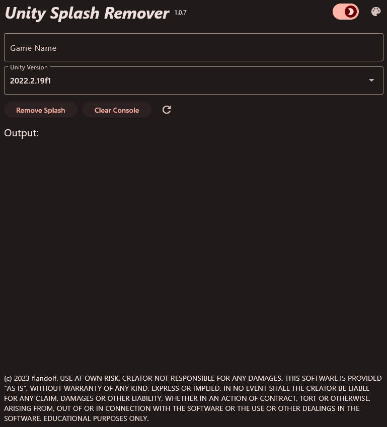
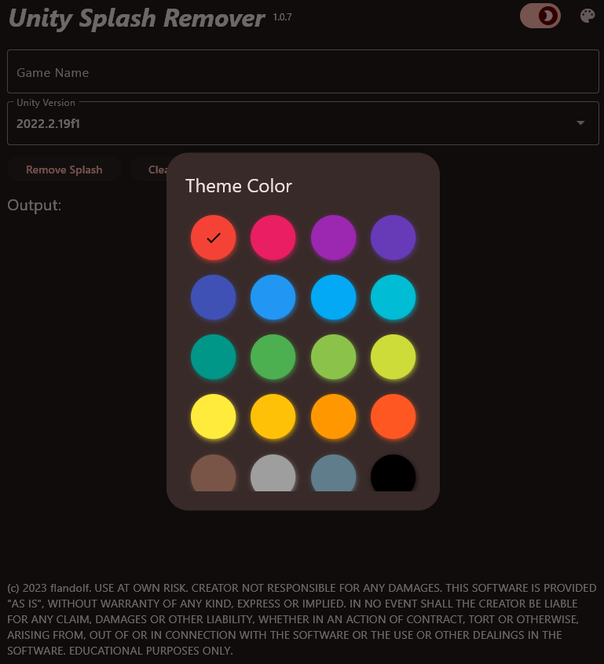

# Unity Splash Remover 🙈

This is an app that removes the Unity splash screen from Windows builds.
## Installation
1. Download the latest release from [here](https://github.com/flandolf/UnitySplashRemover/releases).
2. Extract the zip file.
3. Run `UnitySplashRemover.exe`.
4. Enjoy!
## Dependencies
-   file_picker: ^5.3.0
-   window_manager: ^0.3.2
-   flutter_colorpicker: ^1.0.3
## License
This project is licensed under the MIT License - see the [LICENSE](LICENSE) file for details.
## Disclaimer
This project is not affiliated with Unity Technologies or any of its affiliates. By using this software, you **DO NOT** agree to the terms of the [Unity Software License Agreement](https://unity.com/legal/editor-terms-of-service/software).
The creator of this software is not responsible for any damages caused by the use of this software. Use at your own risk. ***EDUCATIONAL PURPOSES ONLY***
## Screenshots

